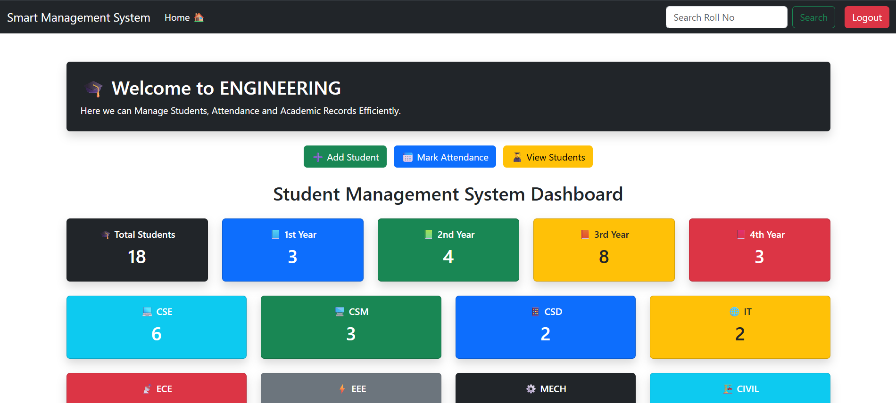
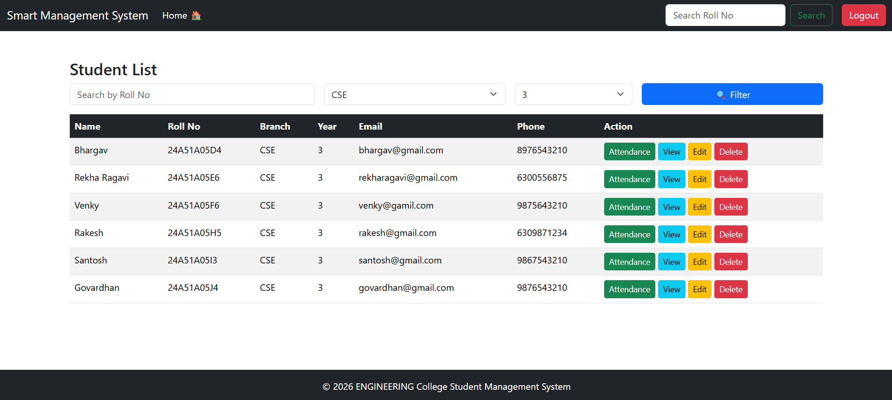
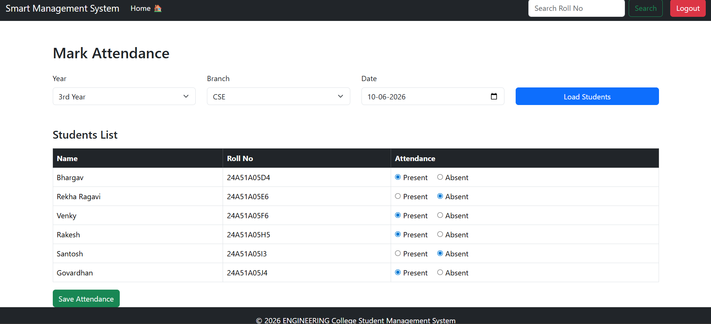
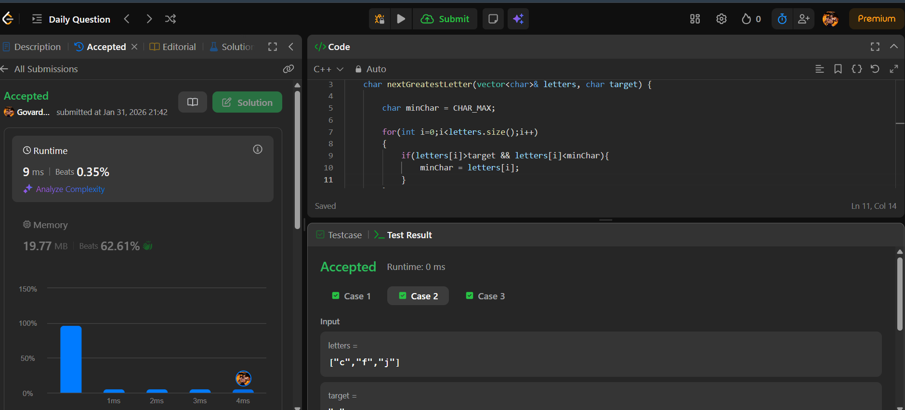

# Student Management System

## Project Overview

The Student Management System is a web-based application developed using Django and Bootstrap to streamline student record management and attendance administration within an educational institution.

This system enables administrators to efficiently manage student information, maintain attendance records, monitor attendance statistics, and access analytical insights through a centralized dashboard.

The project was developed following a structured full-stack development approach, covering database design, backend logic, authentication, data filtering, pagination, attendance tracking, and user interface development.

---

## Key Features

### Student Management
- Add new student records
- View detailed student information
- Update existing student records
- Delete student records
- Unique Roll Number validation

### Authentication & Security
- User Login and Logout
- Protected routes using Django Authentication
- Session-based access control

### Student Search & Filtering
- Search students by Roll Number
- Filter students by Branch
- Filter students by Academic Year
- Combined filtering support
- Pagination for efficient data navigation

### Attendance Management
- Mark attendance by Branch and Year
- Date-wise attendance recording
- Duplicate attendance prevention
- Attendance history for individual students

### Attendance Analytics
- Total Classes Calculation
- Present Days Calculation
- Absent Days Calculation
- Attendance Percentage Calculation

### Dashboard
- Total Student Statistics
- Year-wise Student Distribution
- Branch-wise Student Distribution
- Quick Navigation Actions

---

## Technology Stack

| Technology | Purpose |
|------------|----------|
| Python | Programming Language |
| Django | Backend Framework |
| SQLite | Database |
| Bootstrap 5 | Frontend UI |
| HTML5 | Templates |
| CSS3 | Styling |

---

## Project Structure

```text
student-management-system/
│
├── SMS/
├── student/
├── templates/
├── manage.py
├── requirements.txt
└── .gitignore
```

---

## Learning Outcomes

During the development of this project, the following concepts were implemented and practiced:

- Django Models
- CRUD Operations
- URL Routing
- Django Templates
- Authentication System
- Query Filtering
- Pagination
- Foreign Key Relationships
- Attendance Management Logic
- Dashboard Development
- Git & GitHub Version Control

---

## Future Enhancements

- Export Attendance Reports (PDF/Excel)
- Student Profile Photos
- Role-Based Access Control
- Attendance Reports Dashboard
- Email Notifications

---

## Screenshots

### Dashboard



### Student List



### Attendance Module



### Attendance History



## Author

**Govardhan Tumarada**

Django Student Management System Project
